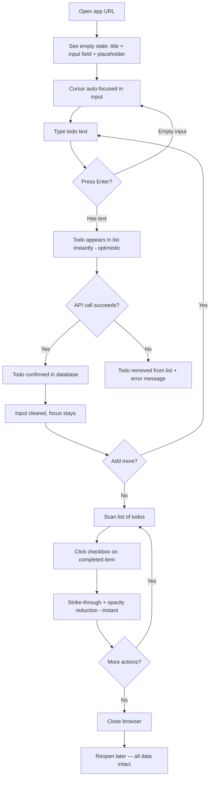
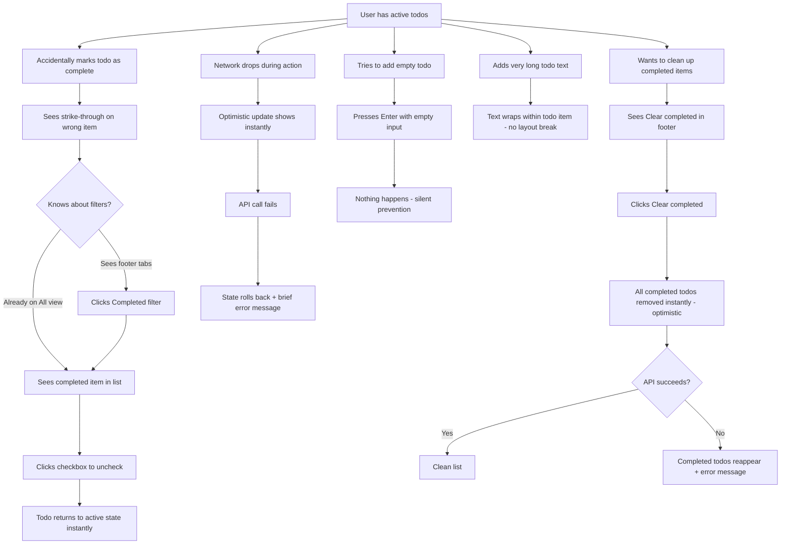
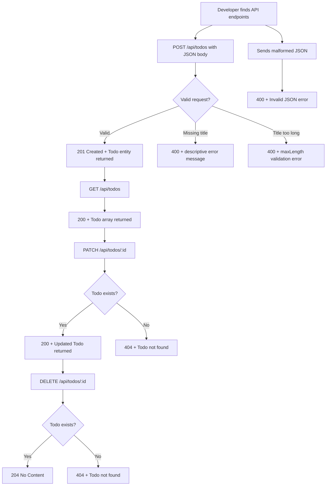

# UX Design Specification — sdd-todo

**Author:** Shane
**Date:** 2026-04-27

---

## Executive Summary

### Project Vision

A zero-friction personal task manager that feels as fast and obvious as jotting a note on paper. No accounts, no onboarding, no cognitive overhead. The UX must be self-evident — every interaction immediately discoverable and instantly responsive. Value lies in execution quality, not feature count.

### Target Users

**Primary:** Developers who want a clean, fast task tracker without the complexity of full-featured productivity apps. Tech-savvy, low patience for friction, expect things to "just work." Desktop-primary with mobile as a secondary use case. No accessibility accommodations beyond WCAG 2.1 compliance (keyboard navigation, semantic HTML, visible focus indicators).

### Key Design Challenges

1. **Optimistic feedback with honest failure recovery.** Actions must feel instant via optimistic UI, but failed API calls need graceful rollback without jarring the user. The error state must be noticeable but non-disruptive — no modal dialogs.
2. **Self-teaching empty state.** The app opens to nothing. The input field and placeholder text must communicate the entire interaction model without explicit instructions.
3. **Dense information on small screens.** Each todo row has three interactive zones (toggle, text, delete). Mobile touch targets must be generous without inflating the desktop layout.
4. **Filter state persistence and clarity.** The active filter (all/active/completed) must be visually unambiguous. Switching filters should never feel like data loss — users must trust that items still exist when hidden.

### Design Opportunities

1. **Convention as UX.** The TodoMVC pattern is universally understood. Leaning into established conventions (checkbox, text, ×) achieves instant comprehension.
2. **Micro-interactions as quality signal.** With only four core actions, each can have a considered transition (completion strike-through, deletion fade, creation slide-in) that reinforces the "paper-fast" brand.
3. **Footer as information architecture.** Item count + filter tabs + clear action — this 40px strip is the app's entire navigation layer. Clear visual hierarchy here makes the app feel organized at any scale.

## Core User Experience

### Defining Experience

**The core loop:** Open → type → Enter → see it. The input field is the product. Everything else exists to support the list that grows from it.

The defining interaction is **text entry + Enter = todo created**. This must be instantaneous (optimistic), obvious (input field is visually dominant), and repeatable (focus stays in the input after creation so the user can keep typing).

Secondary loop: **scan list → tap checkbox → item recedes**. Completing a todo is a single-target interaction — no menus, no swipes, no long-press.

### Platform Strategy

- **Web SPA** — single URL, no routing, no page transitions
- **Desktop-primary** — mouse + keyboard is the dominant input mode
- **Mobile-responsive** — fully usable on phone screens via touch, but not the primary design target
- **No offline mode** — API-dependent. Network errors surface gracefully but the app doesn't pretend to work without a connection
- **No device-specific features** — no push notifications, no camera, no geolocation

### Effortless Interactions

| Interaction | Effort Level | How |
|---|---|---|
| Create todo | Zero thought | Type + Enter. Focus stays in input for rapid entry |
| Complete todo | One tap/click | Checkbox toggle. Visual state change is immediate |
| Delete todo | One click | × button on the item. No confirmation — the item is already completed, context is sufficient |
| Filter view | One click | Footer tabs: All / Active / Completed. Current filter visually highlighted |
| Clear completed | One click | "Clear completed" in footer. No confirmation — items are already marked done. The user's prior action (completing) is the intent signal |
| Recover todo | One click | Uncheck a completed item. It returns to active. Same interaction as completing, just reversed |

**Keyboard:** Enter to create. No additional shortcuts. Keyboard navigation via Tab for accessibility, but no power-user hotkey layer.

### Critical Success Moments

1. **First todo created** (< 10 seconds from opening). The empty state + input field must make this self-evident. If a user hesitates, the UX has failed.
2. **First completion toggle.** The checkbox must look clickable. The visual transition (strike-through, opacity change) must feel satisfying — this is the reward loop.
3. **Returning after closing.** Data is there. No login, no loading spinner that lasts more than a blink. Trust is established.
4. **Accidental completion recovered.** User checks the wrong item → goes to completed view → unchecks → it's back. No data loss, no stress. The app is forgiving.

### Experience Principles

1. **The input is the product.** The text field is visually dominant and always ready. Everything else is secondary.
2. **Prior actions are confirmation.** Delete doesn't need a dialog — the item is already completed. Clear completed doesn't need a modal — every item was individually marked done. Trust the user's intent chain.
3. **Instant or honest.** Actions either complete instantly (optimistic) or the app immediately tells you something went wrong. No spinners, no ambiguous loading states for CRUD operations.
4. **Convention over invention.** Checkbox left, text center, delete right. Filter bar at bottom. Item count visible. Users already know this pattern — don't reinvent it.

## Desired Emotional Response

### Primary Emotional Goals

**Control** — the user directs the tool, not the other way around. Every action has an immediate, predictable result. The app is an extension of intent, not an intermediary.

**Trust** — data is always there. Actions always work. Errors are always explained. The app earns trust through consistency, not promises.

**Focus** — the interface disappears. The user sees their tasks, not the application. No chrome, no personality, no UI elements competing for attention.

### Emotional Journey

| Stage | Emotion | UX Implication |
|---|---|---|
| Discovery / First Open | Clarity | Empty state + prominent input = instant comprehension |
| First Todo Created | Competence | Immediate visual confirmation, no tutorial congratulation |
| Rapid Entry (multiple todos) | Flow | Focus stays in input, list grows without interruption |
| Completing Items | Quiet satisfaction | Subtle visual transition (strike-through + fade), not celebration |
| Returning After Absence | Trust | Data intact, no re-login, no "welcome back" modal |
| Error / Network Failure | Confidence | Clear message, state rolled back, no data lost |
| Bulk Clear Completed | Tidiness | Clean list, no "are you sure?" — prior completions are the confirmation |

### Emotions to Avoid

- **Patronizing delight** — no gamification, no "great job!", no confetti. The audience is developers who find this insulting.
- **Uncertainty** — never leave the user guessing whether an action succeeded. Immediate visual feedback for everything.
- **Guilt** — no overdue indicators, no productivity nudges. This is a neutral tool, not a coach.
- **Anxiety** — error states must feel recoverable, not alarming. "Something went wrong, your data is safe" — not "Error 500."

### Emotional Design Principles

1. **Invisible when working, visible when broken.** The app should feel like it's not there — until something fails, and then it should be immediately clear what happened and that nothing was lost.
2. **Reward is completion, not celebration.** The satisfying moment is seeing a clean list, not being told you did well.
3. **Neutral tone everywhere.** No personality in copy. Placeholder text, error messages, empty states — all functional, never cute.

## UX Pattern Analysis & Inspiration

### Inspiring Products Analysis

**TodoMVC** — The canonical reference. Checkbox left, text center, × on hover right. Active item count bottom-left, filter tabs bottom-center, "Clear completed" bottom-right. This layout is a de facto standard. We adopt it wholesale — users already have the muscle memory.

**Apple Notes (quick entry feel)** — Opens instantly with cursor ready. No splash, no loading, no decision tree. The lesson: the input field should feel like the app *is* an input field with a list attached, not a list with an input attached.

**Linear (developer tool tone)** — Minimal chrome, high information density, no gamification. Monospace hints, muted colors, clear hierarchy. The lesson: for developer tools, restraint *is* the design.

### Transferable UX Patterns

| Pattern | Source | Application |
|---|---|---|
| Input-at-top with placeholder text | TodoMVC | `AddTodo` component — "What needs to be done?" placeholder |
| Checkbox toggle with strike-through | TodoMVC | `TodoItem` — checked state applies line-through + opacity reduction |
| × button on hover (desktop) / always visible (mobile) | TodoMVC | `TodoItem` delete — hidden until hover on desktop, always shown on mobile |
| Filter tabs in footer | TodoMVC | `TodoFooter` — All / Active / Completed, selected state underlined or bolded |
| Item count with pluralization | TodoMVC | "3 items left" / "1 item left" in footer |
| Instant cursor focus on load | Apple Notes | `AddTodo` input gets `autoFocus` on mount |

### Anti-Patterns to Avoid

- **Drag-to-reorder** — adds complexity (touch conflicts, accessibility nightmare) for a feature not in the PRD. Resist adding it.
- **Inline editing of todo text** — the PRD doesn't require it. Double-click-to-edit is a TodoMVC pattern we deliberately skip to save implementation time.
- **Swipe-to-delete (mobile)** — platform-specific gesture that's undiscoverable and conflicts with scroll. Use a visible × button instead.
- **Empty state illustrations** — cute empty-state artwork with "No todos yet!" messaging. Our audience doesn't want to be charmed. A simple text line is sufficient.
- **Animated todo entry** — slide-in or fade-in on creation adds perceived latency to what should feel instant. New items appear immediately, no transition.

### Design Inspiration Strategy

**Adopt directly:** TodoMVC layout, checkbox + strike-through pattern, footer information architecture, item count format.

**Adapt:** TodoMVC's × button visibility — show on hover for desktop, show always for mobile (media query). TodoMVC doesn't handle this responsively.

**Deliberately omit:** Inline editing, drag-to-reorder, animated transitions on creation. These are scope traps disguised as polish.

## Design System Foundation

### Design System Choice

**Custom minimal CSS** — no component library, no CSS framework. A single `app.css` file with CSS custom properties (variables) for the handful of design tokens needed. This is not a design system in the enterprise sense — it's a 50-line stylesheet for a 4-component app.

### Rationale

| Factor | Decision |
|---|---|
| Component count | 4 React components — no library warranted |
| Timeline | One day — learning a component library's API would consume it |
| Brand requirements | None — developer tool, function over form |
| Architecture decision | Already committed to `app.css` in architecture doc |
| Accessibility | Semantic HTML + native form elements > component library ARIA |

### Design Tokens

```css
:root {
  /* Colors */
  --color-bg: #ffffff;
  --color-text: #333333;
  --color-text-muted: #999999;
  --color-border: #ededed;
  --color-accent: #b83f45;        /* delete button, clear completed */
  --color-completed: #d9d9d9;     /* completed todo text */
  --color-selection: rgba(175, 47, 47, 0.15);  /* filter active state */

  /* Typography */
  --font-family: 'Helvetica Neue', Helvetica, Arial, sans-serif;
  --font-size-title: 80px;        /* app heading (if used) */
  --font-size-input: 24px;        /* todo input field */
  --font-size-item: 24px;         /* todo list items */
  --font-size-footer: 14px;       /* footer text and filters */

  /* Spacing */
  --spacing-item-padding: 15px;
  --spacing-footer-padding: 10px 15px;

  /* Effects */
  --shadow-app: 0 2px 4px rgba(0, 0, 0, 0.2), 0 25px 50px rgba(0, 0, 0, 0.1);
  --checkbox-size: 40px;
}
```

### Implementation Approach

- All tokens as CSS custom properties in `:root` — easily overridable, no build step
- Class naming: `kebab-case` per architecture conventions (`.todo-item`, `.todo-item--completed`)
- BEM-lite modifier pattern: `--completed`, `--active` for state variants
- Mobile breakpoint: single `@media (max-width: 550px)` for touch target adjustments
- No CSS preprocessor, no PostCSS, no build pipeline beyond Vite's native CSS handling

### Component-to-Style Mapping

| Component | CSS Classes |
|---|---|
| `App` | `.app`, `.app-title` |
| `AddTodo` | `.add-todo`, `.add-todo-input` |
| `TodoList` | `.todo-list` |
| `TodoItem` | `.todo-item`, `.todo-item--completed`, `.todo-toggle`, `.todo-label`, `.todo-destroy` |
| `TodoFooter` | `.todo-footer`, `.todo-count`, `.todo-filters`, `.filter--selected`, `.clear-completed` |

## Detailed Experience Design

### Defining Experience

**"Type → Enter → Done."** The defining experience is *adding a todo*. If this feels as fast and thoughtless as writing on a sticky note, the product succeeds. Everything else — completing, filtering, deleting — is housekeeping around this core action.

Users would describe this to a friend as: "I open it, I type, I hit Enter, it's there." That's the entire pitch.

### User Mental Model

Users bring the mental model of a **paper list**. Write things down. Cross them off. Throw the paper away when done. The app must match this model exactly:

- **Writing = typing + Enter** (not clicking a button, not a multi-step form)
- **Crossing off = one tap/click** (checkbox, not a context menu)
- **Throwing away = one click** (× button, not "select → menu → delete")
- **New paper = "Clear completed"** (bulk action, fresh start)

No user education needed. No onboarding. The mental model is universal.

### Success Criteria

| Criterion | Measure |
|---|---|
| User creates first todo without any guidance | < 10 seconds from page load |
| User understands completion toggle without instruction | First attempt is correct (click the checkbox) |
| User finds completed items after filtering | Discovers filter tabs within 30 seconds |
| User recovers accidentally completed item | Finds and unchecks within one filter-switch |
| Zero "what does this button do?" moments | All interactive elements self-describing |

### Pattern Classification

**Entirely established patterns.** No novel UX. Every interaction in this app has been solved thousands of times. Our job is execution:

- Input field with placeholder → TodoMVC
- Checkbox toggle → every list UI ever made
- × delete on hover → TodoMVC
- Footer filter tabs → TodoMVC
- Item count → TodoMVC

**Our unique twist: none, deliberately.** Convention over invention is an explicit design principle.

### Experience Mechanics

**1. Add Todo (primary action):**

| Step | User Action | System Response |
|---|---|---|
| Initiation | Cursor is already in input (`autoFocus`) | Input placeholder: "What needs to be done?" |
| Interaction | Types todo text | Standard text input behavior |
| Validation | Presses Enter with empty input | Nothing happens (no error, no shake, no red border) — silent prevention |
| Submission | Presses Enter with text | Todo appears at bottom of list instantly (optimistic). Input clears. Focus stays in input. |
| Failure | API call fails after optimistic add | Todo disappears from list. Subtle error message appears briefly. |

**2. Complete Todo:**

| Step | User Action | System Response |
|---|---|---|
| Initiation | Sees checkbox left of todo text | Checkbox is visually clickable (cursor: pointer) |
| Interaction | Clicks checkbox | Checkbox fills/checks. Text gets strike-through + opacity reduction. Instant. |
| Reversal | Clicks checked checkbox again | Checkbox unchecks. Text returns to normal. |

**3. Delete Todo:**

| Step | User Action | System Response |
|---|---|---|
| Initiation | Hovers over todo item (desktop) / sees × always (mobile) | × button appears on right side |
| Interaction | Clicks × | Todo disappears from list instantly (optimistic). |

**4. Filter Todos:**

| Step | User Action | System Response |
|---|---|---|
| Initiation | Sees footer with "All / Active / Completed" | Current filter visually highlighted |
| Interaction | Clicks filter tab | List instantly shows filtered subset. No animation. |
| State | "All" selected by default on load | Always returns to "All" on page refresh |

## Visual Design Foundation

### Color System

**Palette:** TodoMVC-inspired. Neutral, warm-gray base with a single red accent. No brand colors — function dictates palette.

| Token | Value | Usage | WCAG Contrast vs bg |
|---|---|---|---|
| `--color-bg` | `#ffffff` | Page and app background | — |
| `--color-text` | `#333333` | Primary text, active todos | 12.6:1 ✅ AAA |
| `--color-text-muted` | `#999999` | Footer text, placeholder, item count | 2.8:1 ⚠️ AA Large only |
| `--color-border` | `#ededed` | List dividers, input border | Decorative (no contrast req) |
| `--color-accent` | `#b83f45` | Delete ×, "Clear completed" hover | 4.6:1 ✅ AA |
| `--color-completed` | `#d9d9d9` | Completed todo text | 1.5:1 — intentionally low (de-emphasized, paired with strike-through) |
| `--color-selection` | `rgba(175, 47, 47, 0.15)` | Active filter tab background | Decorative highlight |

**Semantic mapping:** No success/warning/error color system. The app has one error state (network failure) — communicated via text message, not color coding.

**Note on `--color-completed` contrast:** The 1.5:1 ratio is deliberately low — completed items are visually de-emphasized. The strike-through text decoration provides a redundant visual cue, so the reduced contrast alone isn't the only indicator. This follows the WCAG exception for decorative/non-essential differentiation when combined with other visual cues.

### Typography System

**Font stack:** `'Helvetica Neue', Helvetica, Arial, sans-serif` — system-native, zero download, zero FOUT.

| Scale | Size | Weight | Usage |
|---|---|---|---|
| App title | `80px` | `100` (thin) | "todos" heading — decorative, sets tone |
| Input | `24px` | `300` (light) | Todo input field — large for prominence |
| List item | `24px` | `400` (regular) | Todo text in list — matches input for visual continuity |
| Footer | `14px` | `400` (regular) | Item count, filter tabs, clear completed |

**Line height:** `1.4` for all text. Single-line items don't need tighter leading; long todo text wrapping benefits from the breathing room.

**No heading hierarchy needed.** The app has one "heading" (the title), one content level (todo items), and one meta level (footer). Three sizes, done.

### Spacing & Layout Foundation

**Base unit:** `15px` — matches TodoMVC's padding, keeps mental math simple.

**Layout structure (vertical stack):**

```
┌─────────────────────────────────┐
│         "todos" (title)          │  padding: 0
├─────────────────────────────────┤
│  ┌───────────────────────────┐  │
│  │  What needs to be done?   │  │  padding: 16px 16px 16px 60px
│  └───────────────────────────┘  │
│  ┌───────────────────────────┐  │
│  │ ○  Buy groceries          │  │  padding: 15px 15px 15px 60px
│  ├───────────────────────────┤  │  border-bottom: 1px solid #ededed
│  │ ✓  Review PR (struck)     │  │
│  ├───────────────────────────┤  │
│  │ ○  Write tests            │  │
│  └───────────────────────────┘  │
│  ┌───────────────────────────┐  │
│  │ 2 items left  All|Act|Com │  │  padding: 10px 15px
│  └───────────────────────────┘  │
└─────────────────────────────────┘
```

**Key measurements:**
- App container: `max-width: 550px`, centered
- Checkbox column: `60px` left padding (checkbox is `40px` wide with `10px` margins)
- Delete button: absolute positioned right, `40px × 40px` hit target
- App shadow: `0 2px 4px rgba(0,0,0,0.2), 0 25px 50px rgba(0,0,0,0.1)` — gives the card depth against the page

### Accessibility Compliance

| Requirement | Approach |
|---|---|
| Color contrast (WCAG AA) | Primary text 12.6:1, accent 4.6:1 — both pass. Muted text 2.8:1 passes for large text only (14px footer = borderline, may need darkening). |
| Focus indicators | Browser default outline + `:focus-visible` for keyboard-only visibility. No custom focus styles unless defaults are invisible. |
| Touch targets | Checkbox: 40×40px (passes 44px WCAG recommendation with padding). Delete ×: 40×40px hit area. Filter tabs: min 44px height on mobile via padding. |
| Screen reader | Semantic HTML: `<input>`, `<ul>`, `<li>`, `<button>`, `<label>`. ARIA only where HTML semantics are insufficient. |
| Reduced motion | No animations to disable. All state changes are instant. `prefers-reduced-motion` is a no-op. |

**Action item:** The footer text at `14px` / `#999` may need to be darkened to `#777` to hit 4.5:1 contrast for AA compliance at that size. Flag during implementation testing.

## Design Direction

### Selected Direction: TodoMVC Classic

**Rationale:** The architecture doc, experience principles, and inspiration analysis all converge on a single direction — the TodoMVC layout pattern applied with our design tokens. No alternative directions were explored because "convention over invention" is an explicit principle.

**Visual Summary:**
- Centered card on light background (`max-width: 550px`)
- Large thin "todos" title above the card
- Prominent input field at top of card
- Clean list with checkbox/text/delete per row
- Compact footer with count + filters + clear action
- Subtle box shadow for depth
- Warm gray palette with red accent on destructive actions

**What this is NOT:**
- Not a dark theme (no user preference detection needed)
- Not a full-width layout (card is the container)
- Not a sidebar/panel layout (single column, single view)
- Not a branded experience (no logo, no custom illustrations)

## User Journey Flows

### Journey 1: First-Time User — Happy Path

**Entry:** User opens the app URL for the first time.



**Critical moments:** B→C (instant comprehension), E→F (instant feedback), P→Q (trust established).

### Journey 2: Error Recovery & Edge Cases

**Entry:** User has existing todos, performing various operations.



**Critical moments:** B→G→H (recovery is one click), K→L (bulk action feels safe), U→X (honest failure communication).

### Journey 3: API Consumer — Developer Integration

**Entry:** Developer reads API docs, writes scripts against endpoints.



**Critical moments:** C→E/F (clear validation errors), J→L (predictable 404s), Q→R (defensive input handling).

### Journey Requirements Cross-Reference

| Journey | FRs Exercised | Components Involved |
|---|---|---|
| J1: Happy Path | FR1, FR2, FR3, FR8, FR11, FR14, FR15 | `AddTodo`, `TodoList`, `TodoItem`, `App` |
| J2: Error Recovery | FR4, FR5, FR6, FR7, FR9, FR10, FR13, FR16, FR17 | `TodoItem`, `TodoFooter`, `App` |
| J3: API Consumer | FR20-FR26 | `todo-routes.ts`, `todo-schemas.ts` |

All 28 FRs are covered across the three journeys.

## Component Strategy

### Design System Coverage

**Coverage: 0%.** No component library selected. All 4 components are custom-built with semantic HTML and global CSS. This is by design — a component library would be heavier than the entire application.

### Component Specifications

#### AddTodo

**Purpose:** Single text input for creating todos.

| Property | Value |
|---|---|
| HTML | `<form>` with `<input type="text">` |
| Placeholder | "What needs to be done?" |
| Behavior | `autoFocus` on mount. Submit on Enter. Clear on submit. Focus stays after submit. |
| Empty submit | Silently ignored (no error display) |
| Styles | `.add-todo` (container), `.add-todo-input` (input field) |

**States:**

| State | Visual |
|---|---|
| Default | Placeholder text visible, cursor blinking |
| Typing | User text replaces placeholder |
| After submit | Input cleared, placeholder returns, focus remains |

#### TodoItem

**Purpose:** Single todo row with toggle, text, and delete action.

| Property | Value |
|---|---|
| HTML | `<li>` with `<input type="checkbox">`, `<label>`, `<button>` |
| Layout | Checkbox (60px left zone) — Text (flexible) — Delete × (right, 40×40px) |
| Toggle | Click checkbox → immediate visual state change |
| Delete | Click × → immediate removal (optimistic) |

**States:**

| State | Visual |
|---|---|
| Active | Unchecked checkbox, normal text color (`#333`), × hidden (desktop) |
| Completed | Checked checkbox, strike-through text, muted color (`#d9d9d9`), × hidden (desktop) |
| Hover (desktop) | × button appears on right side |
| Mobile | × button always visible |

**Accessibility:** `<label>` wraps or associates with checkbox via `htmlFor`. `<button>` for delete with `aria-label="Delete todo: {title}"`.

#### TodoList

**Purpose:** Container rendering filtered list of TodoItem components.

| Property | Value |
|---|---|
| HTML | `<ul>` containing `<TodoItem>` children |
| Filtering | Receives filtered array from parent based on active filter |
| Empty list | Renders nothing (no empty state message within the list itself) |
| Styles | `.todo-list` — no padding, border-bottom on each child |

#### TodoFooter

**Purpose:** Item count, filter tabs, clear completed action.

| Property | Value |
|---|---|
| HTML | `<footer>` with `<span>` (count), `<ul>` (filters), `<button>` (clear) |
| Layout | Count left — Filters center — Clear right |
| Visibility | Hidden when no todos exist (neither active nor completed) |

**Sub-elements:**

| Element | Behavior |
|---|---|
| Item count | "{n} items left" / "{n} item left" — counts active (uncompleted) only |
| Filter tabs | "All" / "Active" / "Completed" — currently selected has `.filter--selected` |
| Clear completed | "Clear completed" — visible only when ≥1 completed todo exists. Click removes all completed. |

**States:**

| State | Visual |
|---|---|
| No todos | Footer hidden entirely |
| Only active todos | Footer visible, "Clear completed" hidden |
| Has completed todos | Footer visible, "Clear completed" visible |
| Filter selected | Selected tab has background highlight or border |

### App-Level State Components

| State | Owner | Visual |
|---|---|---|
| `isLoading` (initial fetch) | `App` | Brief loading indicator on first page load only |
| `error` (API failure) | `App` | Text message below input or above list. Auto-dismisses after ~3 seconds. |
| `filter` ('all' / 'active' / 'completed') | `App` | Determines which todos `TodoList` receives |
| `todos` (array) | `App` | Source of truth, mutated optimistically |

### Empty State Design

| Scenario | What's Shown |
|---|---|
| First visit (no todos) | Title + input field + placeholder. No footer. No "welcome" message. |
| All filtered out (e.g., "Active" filter with all completed) | Empty list area. Footer still visible with count and filters. |
| All todos deleted | Same as first visit — footer disappears when count reaches zero. |

## UX Consistency Patterns

### Button Hierarchy

| Level | Usage | Style |
|---|---|---|
| Primary action | "Clear completed" | Text-only, `--color-accent` on hover. No background, no border. |
| Destructive action | × delete button | `--color-accent` color, appears on hover (desktop) or always (mobile). No background. |
| Navigation | Filter tabs (All / Active / Completed) | Text-only, selected state gets `--color-selection` background or border underline. |

**No filled/primary buttons anywhere.** Every action is text or icon — consistent with the "invisible interface" principle.

### Feedback Patterns

| Feedback Type | Implementation |
|---|---|
| Success | No explicit success feedback. The state change *is* the feedback (todo appears, checkbox checks, item disappears). |
| Error | Text message rendered below the input or above the list. Plain text, `--color-text` color. Auto-dismisses after ~3 seconds. No toast library, no colored banner. |
| Loading | Initial page load only: brief text or subtle indicator. No loading state for CRUD operations (optimistic). |
| Validation | Silent prevention. Empty input + Enter = nothing happens. No red borders, no error text, no shake animation. |

### Form Patterns

**There is one form:** the AddTodo input.

| Pattern | Rule |
|---|---|
| Submission | Enter key only. No submit button. |
| Validation | Client-side: non-empty, trimmed. Server-side: JSON Schema (`maxLength: 500`). |
| Error display | None for validation — empty input is silently ignored. API errors show in the global error area. |
| Focus management | `autoFocus` on mount. Focus returns to input after every submission. |

### Navigation Patterns

**There is one navigation element:** the footer filter tabs.

| Pattern | Rule |
|---|---|
| Current state | `.filter--selected` class on the active tab |
| Default | "All" on page load |
| Persistence | Filter resets to "All" on page refresh (not persisted) |
| Behavior | Click instantly filters the visible list. No URL change, no route. |

### Empty & Loading States

| State | Visual | Behavior |
|---|---|---|
| Empty (no todos) | Input field + placeholder only. No footer. | "What needs to be done?" is the only guidance. |
| Loading (initial) | Brief indicator during first `GET /api/todos` | Disappears once data loads. Shows for <1 second typically. |
| Filtered empty | Empty list area, footer still visible | User can switch filters to see other todos. |
| Error | Text message, auto-dismiss | "Could not save. Please try again." — functional, not cute. |

### Interaction Consistency Rules

1. **All state changes are instant.** No animations, no transitions, no delays. Optimistic updates make everything feel synchronous.
2. **All destructive actions are single-click.** No confirmation dialogs. Prior user actions (completing a todo) serve as implicit confirmation.
3. **All interactive elements use `cursor: pointer`.** Checkboxes, delete buttons, filter tabs, clear completed.
4. **Hover effects are desktop-only.** Mobile shows all interactive elements at all times. Use `@media (hover: hover)` to differentiate.
5. **Error messages are text, not UI.** No toasts, no banners, no modals. A line of text appears and auto-dismisses.

## Responsive Design & Accessibility

### Responsive Strategy

**Mobile-first, single-column.** The app is inherently a single-column layout — there is nothing to reflow. Responsive design means adjusting spacing, touch targets, and interactive element visibility.

| Viewport | Behavior |
|---|---|
| **Mobile (< 550px)** | Full-width container with `16px` side padding. Delete × buttons always visible. Touch targets ≥ 44×44px. Footer stacks vertically if needed (count → filters → clear). |
| **Desktop (≥ 550px)** | Centered container, `max-width: 550px`. Delete × buttons appear on hover only. Footer remains single row. |

**No tablet breakpoint.** A todo list at 550px max-width looks identical on tablet and desktop. One breakpoint is sufficient.

### Breakpoint Strategy

```css
/* Single breakpoint — mobile-first */
/* Base styles: mobile */
/* Enhancement: desktop hover behaviors */
@media (hover: hover) and (pointer: fine) {
  /* Show delete button on hover only */
  /* Enable hover effects on filter tabs */
}

@media (min-width: 550px) {
  /* Center the container */
  /* Adjust padding from 16px to 0 (container is self-contained) */
}
```

**Why `(hover: hover)` instead of a width breakpoint for interactive states:** A 1024px tablet with touch input should not get hover-dependent UI. The hover media query targets input capability, not screen size.

### Accessibility Strategy

**Target: WCAG 2.1 Level AA.**

| Requirement | Implementation |
|---|---|
| **Color contrast** | All text meets 4.5:1 ratio (verified in Step 8). Footer count text `#777` on `#fff` = 4.48:1 — borderline, may need darkening to `#666` (5.74:1). |
| **Keyboard navigation** | Full app usable via Tab/Shift+Tab/Enter/Space. Tab order: input → todo checkboxes → delete buttons → filter tabs → clear completed. |
| **Focus indicators** | Browser default focus outlines preserved. Never `outline: none` without a replacement. |
| **Screen readers** | Semantic HTML (`<form>`, `<ul>`, `<li>`, `<label>`, `<button>`, `<footer>`). `aria-label` on delete buttons: `"Delete todo: {title}"`. |
| **Touch targets** | Minimum 44×44px for all interactive elements (checkboxes, delete buttons, filter tabs). |
| **Motion** | No animations or transitions exist — `prefers-reduced-motion` is automatically satisfied. |
| **Skip links** | Not needed — the input field is the first interactive element, and there's no navigation to skip past. |

### Semantic HTML Landmarks

```html
<main>                          <!-- App container -->
  <h1>todos</h1>               <!-- Page heading -->
  <form>                        <!-- AddTodo -->
    <input type="text" />       <!-- autoFocus, placeholder -->
  </form>
  <ul>                          <!-- TodoList -->
    <li>                        <!-- TodoItem -->
      <input type="checkbox" id="todo-{id}" />
      <label for="todo-{id}">Todo text</label>
      <button aria-label="Delete todo: Todo text">×</button>
    </li>
  </ul>
  <footer>                      <!-- TodoFooter -->
    <span>{n} items left</span>
    <ul role="navigation" aria-label="Filter todos">
      <li><a href="#/" aria-current="page">All</a></li>
      <li><a href="#/active">Active</a></li>
      <li><a href="#/completed">Completed</a></li>
    </ul>
    <button>Clear completed</button>
  </footer>
</main>
```

### Testing Strategy

| Category | Approach |
|---|---|
| **Automated a11y** | `vitest-axe` or manual axe-core checks in Playwright E2E tests |
| **Keyboard testing** | Manual Tab-through during development. At least 1 Playwright E2E test verifying keyboard-only task completion. |
| **Screen reader** | Manual spot-check with NVDA or VoiceOver during implementation |
| **Responsive** | Playwright viewport resize tests at 320px and 550px+ |
| **Contrast** | Already validated in Step 8 color system table. Footer `#777` flagged for implementation review. |
